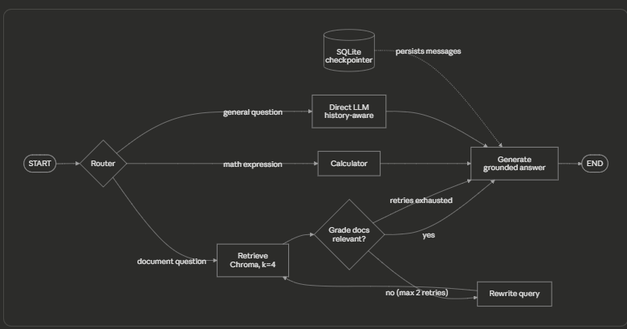

<<<<<<< HEAD
<<<<<<< HEAD
<<<<<<< HEAD

#  RAG Portfolio phase -3


An evolving Retrieval-Augmented Generation (RAG) system built with LangGraph and Gemini, progressing phase-by-phase from a basic RAG pipeline to a production-style multi-agent system. Each phase is tagged in Git, making the repository both a working project and a documented learning journey.

**Current Status:** Phase 3 — Persistent Memory + Chat UI

## Architecture

Every user query flows through a LangGraph workflow. Conversation history is stored in a SQLite checkpointer using a unique `thread_id`, allowing memory to persist across application restarts and remain shared between both the CLI and Streamlit interfaces.

The memory belongs to the graph itself rather than any specific UI.


=======
#  RAG Portfolio phase -3

An evolving Retrieval-Augmented Generation (RAG) system built with LangGraph and Gemini, progressing phase-by-phase from a basic RAG pipeline to a production-style multi-agent system. Each phase is tagged in Git, making the repository both a working project and a documented learning journey.

**Current Status:** Phase 3 — Persistent Memory + Chat UI

## Architecture

Every user query flows through a LangGraph workflow. Conversation history is stored in a SQLite checkpointer using a unique `thread_id`, allowing memory to persist across application restarts and remain shared between both the CLI and Streamlit interfaces.

The memory belongs to the graph itself rather than any specific UI.


>>>>>>> 9bc1d9e (Phase 3: persistent memory, Streamlit UI, mock LLM mode, latency instrumentation)
=======
#  RAG Portfolio phase -3

An evolving Retrieval-Augmented Generation (RAG) system built with LangGraph and Gemini, progressing phase-by-phase from a basic RAG pipeline to a production-style multi-agent system. Each phase is tagged in Git, making the repository both a working project and a documented learning journey.

**Current Status:** Phase 3 — Persistent Memory + Chat UI

## Architecture

Every user query flows through a LangGraph workflow. Conversation history is stored in a SQLite checkpointer using a unique `thread_id`, allowing memory to persist across application restarts and remain shared between both the CLI and Streamlit interfaces.

The memory belongs to the graph itself rather than any specific UI.


>>>>>>> 9bc1d9e (Phase 3: persistent memory, Streamlit UI, mock LLM mode, latency instrumentation)
=======
#  RAG Portfolio phase -3

An evolving Retrieval-Augmented Generation (RAG) system built with LangGraph and Gemini, progressing phase-by-phase from a basic RAG pipeline to a production-style multi-agent system. Each phase is tagged in Git, making the repository both a working project and a documented learning journey.

**Current Status:** Phase 3 — Persistent Memory + Chat UI

## Architecture

Every user query flows through a LangGraph workflow. Conversation history is stored in a SQLite checkpointer using a unique `thread_id`, allowing memory to persist across application restarts and remain shared between both the CLI and Streamlit interfaces.

The memory belongs to the graph itself rather than any specific UI.


>>>>>>> 9bc1d9e (Phase 3: persistent memory, Streamlit UI, mock LLM mode, latency instrumentation)

---

## Features

### PDF Ingestion Pipeline

* Recursive text chunking with overlap
* Source metadata preservation
* Persistent Chroma vector database
* Embed once, query forever

### Conditional Routing

Questions are automatically routed to:

* Calculator tool
* Vector store retrieval
* Direct LLM response

### Document Grading

* LLM-as-judge relevance checking
* Filters irrelevant retrieval results before generation

### Corrective Retrieval Loop

* Automatic query rewriting when retrieval fails
* Maximum of two retry attempts

### Grounded Generation

* Answers are generated using retrieved context
* Refuses to hallucinate when sufficient context is unavailable

### Persistent Conversational Memory

* `add_messages` reducer
* `SqliteSaver` checkpointer
* Conversations resume across restarts using `thread_id`

### Streamlit Chat UI

* Multi-conversation sidebar
* One `thread_id` per chat
* Route badge displayed under every response showing the graph path taken

### Developer Tooling

* Per-node latency instrumentation
* Zero-token Mock LLM mode for debugging

---

## Tech Stack

| Layer           | Choice                            |
| --------------- | --------------------------------- |
| Orchestration   | LangGraph + SqliteSaver           |
| LLM             | Gemini 2.5 Flash                  |
| Embeddings      | Gemini Embeddings                 |
| Vector Store    | Chroma (Persistent Local Storage) |
| UI              | Streamlit                         |
| Package Manager | uv                                |

---

## Setup

```bash
git clone <repo-url>
cd agentic-rag-portfolio

uv sync
# or
pip install -r requirements.txt

cp .env.example .env
# Add your GOOGLE_API_KEY

# Step 1: Put PDFs inside data/raw/
python src/ingest.py data/raw

# Step 2a: Terminal Chat
python src/rag_graph.py

# Step 2b: Web UI
streamlit run src/app.py
```

---

## Developer Mode: Debugging Without Burning Tokens

### Mock LLM Mode

The graph can make multiple LLM calls per query. During development, testing graph logic is often more important than testing model quality.

A `MOCK_LLM` environment variable swaps the Gemini client for a lightweight mock implementation.

```powershell
$env:MOCK_LLM="1"   # Mock mode
$env:MOCK_LLM="0"   # Real Gemini mode
```

### How It Works

Every node calls:

```python
llm.invoke(prompt)
```

and only consumes the returned `.content`.

At startup, a single configuration switch determines whether `llm` points to:

* The real Gemini client
* A `MockLLM` implementation with the same interface

This dependency-injection approach allows all graph nodes to remain unchanged.

The mock returns context-aware responses:

* Grader nodes receive "yes" or "no"
* Rewriter nodes receive rewritten queries
* Generation nodes receive canned responses

This makes failure paths easy to test.

For example, forcing the grader to return `"no"` allows the entire corrective retrieval loop to be exercised without making a single API call.

### Why This Matters

LLM calls are the most expensive and rate-limited resource in the system.

Separating:

* Graph testing
* Model testing

keeps development iterations fast while preserving API quota.

---

## Per-Node Latency Instrumentation

Each node that performs API work is timed using a simple pattern:

```python
def grade_documents_node(state: State):
    t0 = time.time()

    # node logic

    print(f"⏱ grade took {time.time()-t0:.1f}s")
    return {...}
```

This provides visibility into where time is actually being spent inside the graph.

---

## Case Study: The "Minutes of Waiting" Bug

Early testing revealed response times stretching into minutes.

Timing instrumentation showed that the issue was not slow API calls. Individual calls averaged only 3–4 seconds.

The real issue was call multiplication:

1. Keyword routing occasionally sent casual questions to retrieval.
2. The grader correctly rejected irrelevant chunks.
3. The corrective retrieval loop rewrote and retried the query.
4. Multiple sequential LLM calls accumulated.

A single user query could trigger up to seven API calls.

This also increased the likelihood of:

* Free-tier rate limits
* Exponential backoff retries
* Higher token costs

### Key Lesson

Agentic systems amplify upstream decisions.

A small routing mistake became:

* 10× higher latency
* 10× higher token consumption

### Next Improvement

Phase 4 will replace keyword routing with an LLM router using structured output and evaluate routing accuracy to measure improvements.

---

## Project Structure

```text
├── data/
│   └── raw/                # Source PDFs

├── src/
│   ├── ingest.py           # Load → chunk → embed → persist
│   ├── rag_graph.py        # LangGraph workflow
│   └── app.py              # Streamlit chat UI

├── evals/                  # Phase 4: Golden dataset + RAGAS
├── tests/
└── archive/                # Earlier learning experiments
```

---

## Phase Log

| Phase | Tag                    | What Was Added                                                          | Key Learning                                                                                                              |
| ----- | ---------------------- | ----------------------------------------------------------------------- | ------------------------------------------------------------------------------------------------------------------------- |
| 1     | phase-1-foundation     | Ingestion separated from runtime, persistent Chroma                     | Why chunking strategy matters and why ingestion should be separate from querying                                          |
| 2     | phase-2-agentic-rag    | Relevance grading and corrective retrieval loop                         | Similarity search alone is insufficient; retrieved context must be validated                                              |
| 3     | phase-3-memory-chatbot | Persistent memory, Streamlit UI, Mock LLM mode, latency instrumentation | Memory belongs in the graph, not the UI. Agentic loops amplify routing errors. Mock dependencies enable faster debugging. |


```
```
